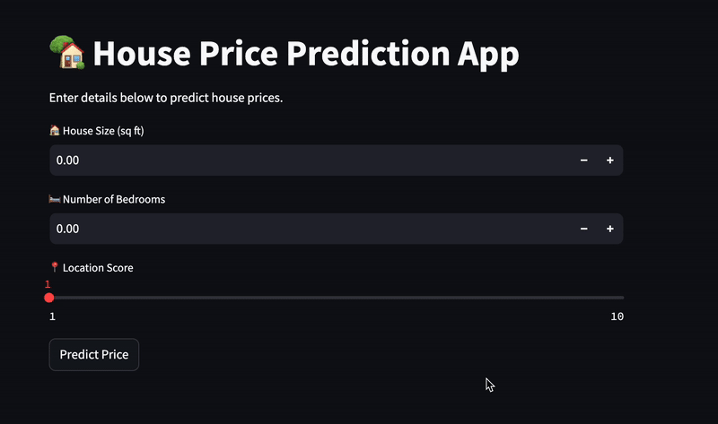

# 🏡 House Price Prediction  

## 📌 Project Overview  
This is my **first small Machine Learning project**, where I built a **House Price Prediction Model** using **Python & ML**. The model predicts house prices based on **size, number of bedrooms, and location score**.  

## 🎥 Project Demo  
Watch the video demo here:  

## 🛠 Tech Stack  
- **Python**  
- **Pandas, NumPy**  
- **Matplotlib, Seaborn**  
- **Scikit-Learn** (Linear Regression)  
- **Jupyter Notebook**  

## 🔗 GitHub Repository  
[(https://github.com/mohanrao06/House-Price-Prediction)]  
